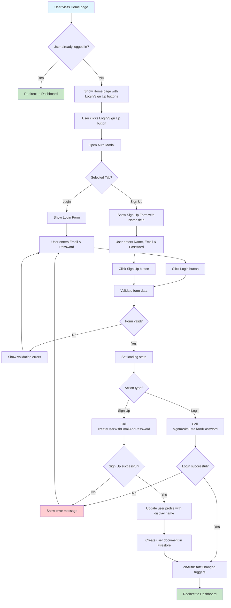
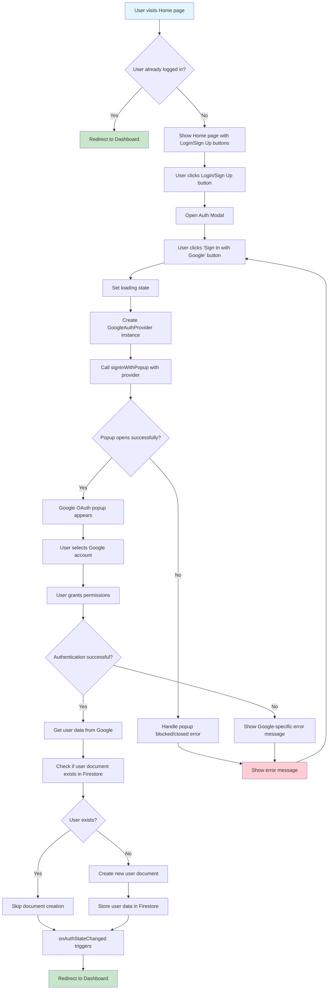
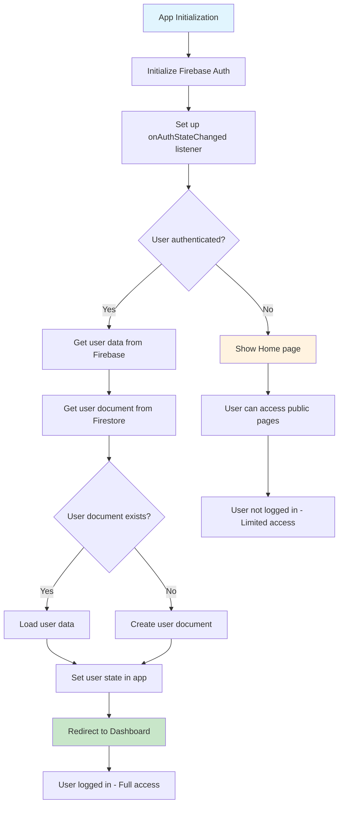
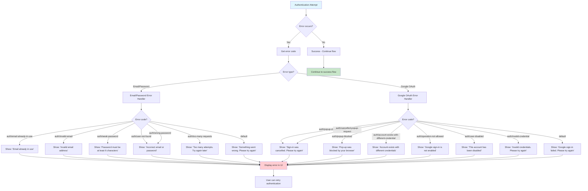
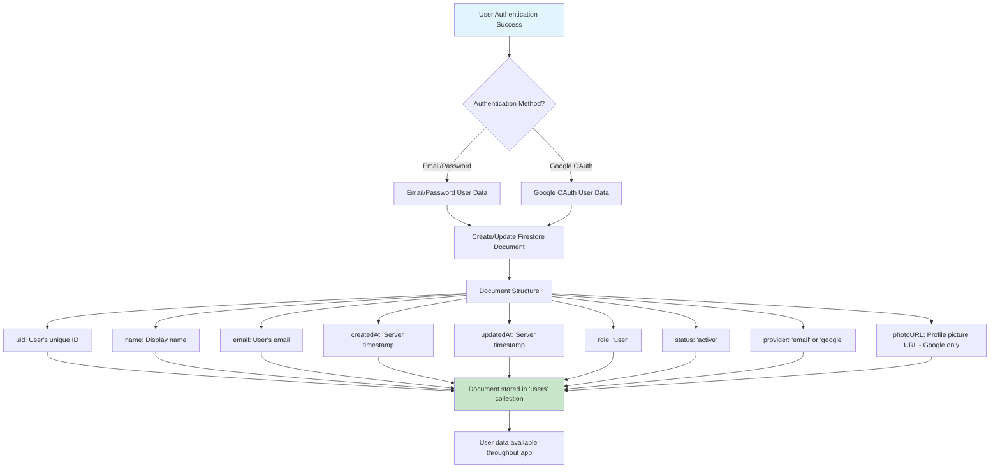
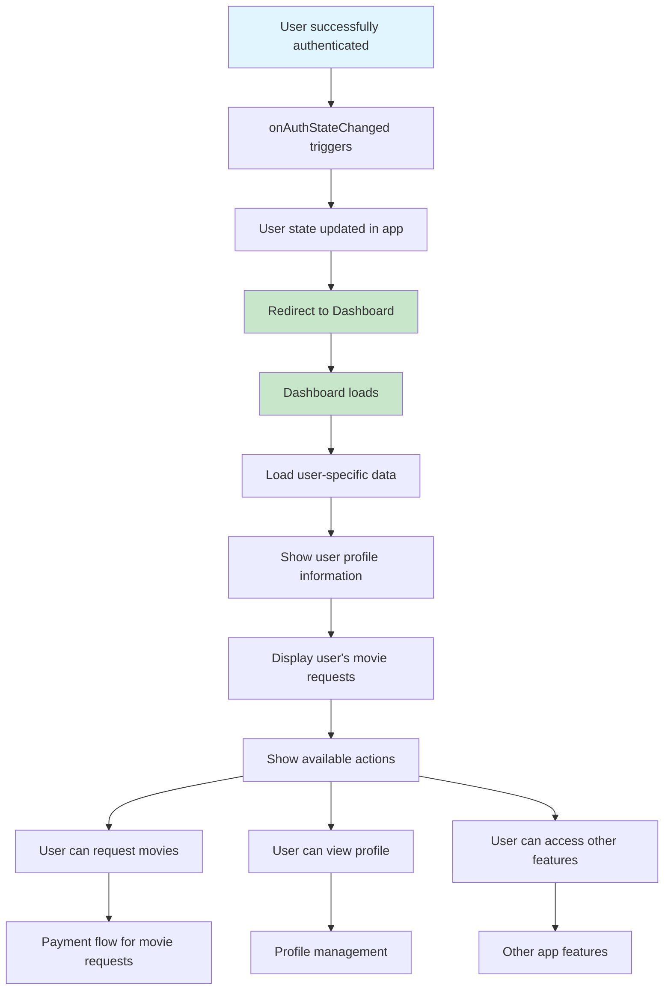
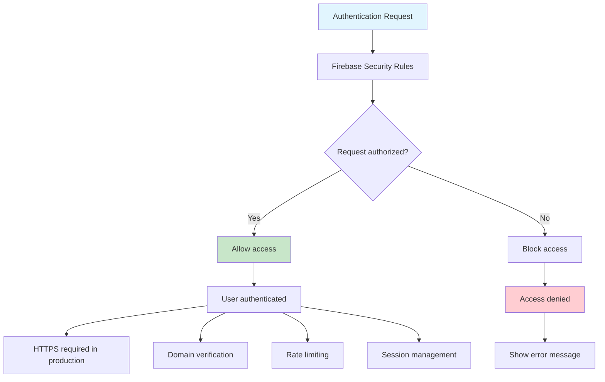

# Login Flow Diagram Documentation

## Overview
This document provides detailed flow diagrams for the authentication system in MovieHub, covering both email/password and Google authentication methods.

## Authentication Methods

### 1. Email/Password Authentication
### 2. Google OAuth Authentication

---

## 1. Email/Password Login Flow

---

## 2. Google OAuth Login Flow

---

## 3. Complete Authentication State Management Flow

---

## 4. Error Handling Flow

---

## 5. User Data Flow in Firestore

---

## 6. Navigation Flow After Authentication

---

## 7. Security Flow

---

## Key Components in the Flow

### Frontend Components
- **Home.jsx**: Main landing page with authentication modal
- **Auth Modal**: Contains login/signup forms and Google button
- **Dashboard.jsx**: Protected page for authenticated users

### Backend Services
- **Firebase Authentication**: Handles user authentication
- **Firestore**: Stores user data and preferences
- **Google OAuth**: Third-party authentication provider

### State Management
- **onAuthStateChanged**: Listens for authentication state changes
- **React Router**: Handles navigation and protected routes
- **Local State**: Manages UI state (loading, errors, form data)

### Security Features
- **HTTPS**: Required for production
- **Domain Verification**: Configured in Firebase console
- **Rate Limiting**: Handled by Firebase
- **Session Persistence**: Configured for seamless experience

---

## Testing Scenarios

### Email/Password Authentication
1. **Valid Login**: Correct email and password
2. **Invalid Login**: Wrong email or password
3. **New Sign Up**: New user registration
4. **Existing Email**: Sign up with existing email
5. **Weak Password**: Password less than 6 characters
6. **Invalid Email**: Malformed email address

### Google OAuth Authentication
1. **Successful Login**: Valid Google account
2. **Popup Blocked**: Browser blocks popup
3. **User Cancels**: User closes popup
4. **Account Disabled**: Google account disabled
5. **Different Credentials**: Account exists with different method
6. **Network Error**: Connection issues

### General Scenarios
1. **Already Logged In**: User visits home page while authenticated
2. **Session Expiry**: User session expires
3. **Multiple Tabs**: User opens multiple tabs
4. **Browser Refresh**: Page refresh during authentication
5. **Network Issues**: Poor internet connection

---

## Error Codes Reference

### Email/Password Errors
- `auth/email-already-in-use`: Email already registered
- `auth/invalid-email`: Invalid email format
- `auth/weak-password`: Password too weak
- `auth/user-not-found`: User doesn't exist
- `auth/wrong-password`: Incorrect password
- `auth/too-many-requests`: Rate limit exceeded

### Google OAuth Errors
- `auth/popup-closed-by-user`: User closed popup
- `auth/popup-blocked`: Browser blocked popup
- `auth/cancelled-popup-request`: Popup cancelled
- `auth/account-exists-with-different-credential`: Account conflict
- `auth/operation-not-allowed`: Google auth not enabled
- `auth/user-disabled`: Account disabled
- `auth/invalid-credential`: Invalid credentials

This comprehensive flow documentation provides a complete understanding of the authentication system in MovieHub, covering all scenarios, error handling, and security considerations. 